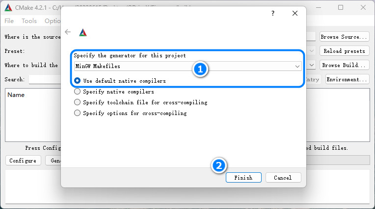
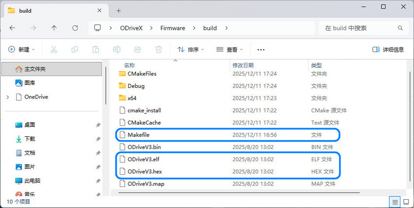
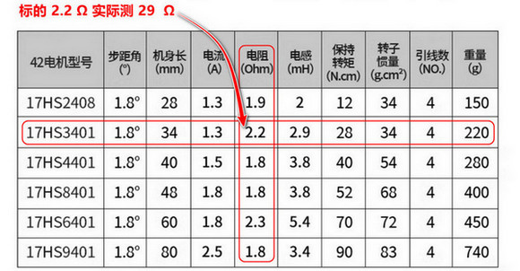
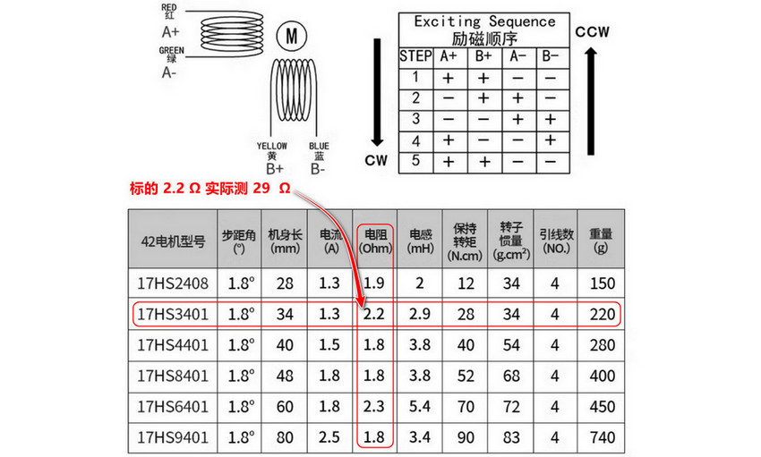
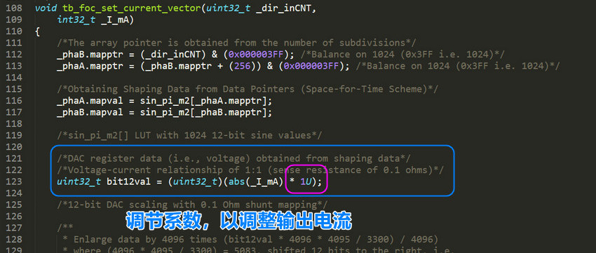

# Motor42

转速-扭矩特性步进电机运用普通的开环控制方式在低速和低负载的情况下可以保持较好的控制精度，但随着负载增大或转速度增加会发生丢步，另一个是转速-扭矩特性让步进电机无法在高转速下稳定工作。

## 特性

在低速状态下，步进电机的扭矩特性曲线通常为水平直线，能够提供较高的扭矩。在高速状态下，由于电感的影响，扭矩特性曲线呈指数下降，导致电机的负载能力显著降低。

> **最大扭矩：** 最大扭矩出现在中低转速范围，随着转速的提高，扭矩会逐渐下降。因为在高频率下，电流流动受到绕组电感的影响，导致电流无法达到稳定值，从而扭矩降低。
> 
> **启动扭矩与连续扭矩：** 启动扭矩指在启动时能够提供的最大扭矩，而连续扭矩则指电机持续运行时能够维持的扭矩。随着脉冲频率的增加，启动扭矩和连续扭矩都会下降。

## 闭环

闭环控制是在开环控制的基础上，增加了 **反馈检测环节**（例如在电机轴增加编码器），形成指令-执行-位置检测-修正的闭环逻辑。解决存在的丢步、偏差、抗干扰能力弱问题，还能提升系统和容错能力。

## FOC 控制

混合式步进电机与无刷电机的内在联系（结构定义相似性，工作原理相似性），所以可以用无刷电机 FOC 的驱动思想驱动步进电机。

结构方面：永磁转子+定子绕组的结构，定子方面：两者都有多相绕组（步进电机通常为两相，无刷电机通常为三相），转子方面：都采用永磁材料制造转子磁极，无刷设计：两者都没有电刷和机械换向器，依靠电子换向。

对于两相步进电机，虽然只有两个绕组，但通常两相绕组是正交的，从而可以简化步骤，省略我们的 clarke 变换，所以其余同样可以采用类似的思路进行一个电流环FOC控制。

    电流检测：对 AB 两相电流进行检测
    Park变换：将 AB 轴静止系转换为dq轴旋转坐标系
    PI调节器：对 Id 和 Iq 进行控制
    Invpark变换：讲 dq 轴转换为AB轴
    SVPWM调制: 输出占空比
    双 H桥驱动：驱动我们的步进电机

这些可以整合到一个驱动器中实现，如下图。这就是一体化集成步进电机闭环驱动器。板上集成磁编码器，具有速度，位置，电流闭环控制功能，适用于 3D 打印机，小型机械臂。


## 硬件

(1) 2 相逆变功率级：东芝凌耐压 50V，载流3.5A 的 PWM 斩波式双全桥电机驱动器，内置带低导通电阻的输出MOSFET（基于成本考虑可以选择其他的型号）。

(2) RS485 收发器：TI 德州仪器 SN75176B（基于成本考虑可以选择其他的型号）。

(3) CAN2.0B 收发器：NXP 恩智浦 High-speed CAN transceiver TJA1051（基于成本考虑可以选择其他的型号）。

(4) 磁编码器：MagnTek 麦歌恩 mt6816 单圈绝对式14位编码器，支持最高转速25Krpm。

(6) 主控 MUC 芯片：意法半导体 STM32F103。

## 关于打样

驱动器板 Motor42（PCB 采用?**4 层板**?设计）：[HardWare/kiacd_project](./HardWare/kiacd_project)

如果想自己修改 PCB 需要安装 KiCad（开源的 EDA 工具，也非常易学），官方下载地址： https://www.kicad.org/。

打样制作可以直接进入到下面这两个路径下：

把 Motor42 Gerber 文件夹 [HardWare/Gerber](./Docs/Motor42-PCB/) 压缩为 Motor42.zip，

把这个 .zip 给 PCB 制造厂即可（例如 JLC，**PCB 经过打样验证，可以放心使用**）。

**器件 BOM 目录**：[HardWare/ibom.html](./Docs/Motor42-BOM.csv)（PCB 没器件位号，按网页交互式 BOM 贴片）。

原理图 PDF 目录： [Docs/Motor42-SCH.csv](Docs/Motor42-SCH.pdf)

## 核心固件

固件主要包括几大功能模块：

- hal 驱动：板载的各种硬件驱动比如 USB、Tim、Can、Spi。
- utils 库：STM32 的 Flash 存储接口，Modbus 协议解析库，软定时器组件。
- drivers：ARM的CMSIS驱动，ST官方的HAL库。
- device：电机H桥驱动，编码器驱动和校准，电机控制核心代码，LED 驱动框架 LedMX 和按键驱动 MultiButton。
- main：上层 Can，Rs485 应用控制协议，用于控制同步电机状态/参数，以及用户设置参数保存功能。

## 编译下载

固件没有使用 ARM Keil 开发，而是先用 CMake 构建出 Makefile，然后再用 arm-gcc 编译（可以自己创建 F103 的 Keil 工程，把 Motor42 组织到 Keil 编译）。

Motor42 用的是 VSCode 搭配 OpenOCD 图形化下载调试，需要下载安装下列工具链：

MiniGW： https://sourceforge.net/projects/mingw-w64/files/

arm-gcc ：[Downloads | GNU Arm Embedded Toolchain Downloads – Arm Developer](https://developer.arm.com/downloads/-/gnu-rm)

openOCD：[Download OpenOCD for Windows](https://gnutoolchains.com/arm-eabi/openocd/)

CMake：[Download CMake](https://cmake.org/download/)

VSCode：[https://code.visualstudio.com/](https://code.visualstudio.com/)

> 安装后具体如何配置使用这些工具，篇幅较长不写在这里，我把具体配置使用方法写在这里：[工具链配置使用方法](https://blog.csdn.net/jf_52001760/article/details/126826393)。

**Motor42 编译步骤**：

把 cmake 脚本 CMakeLists.txt 的目录添加到 `1` 这里，如下图。


(2) 在 Firmware 目录下创建 build 目录，并指定到 `2` 这里。

(3) 点击 "Configure"，在弹出面板选择目标工程，如下图。



(5) 在 vscode 的命令行 `cd build` 进入`build/`目录，然后执行 make -j2 即可开始编译。



(6) 使用 openOCD 把 `.elf` 文件下载到 Motor42 硬件，下载方法同样参照 [工具链配置使用方法](https://blog.csdn.net/jf_52001760/article/details/126826393)（PCB 上预留了 SWD 调试接口同时支持固件下载）。

## 电机选型

电机可以在淘宝搜索购买，最好购买低相电阻步进电机（较好的电机的相电阻通常为 2-5 Ohm）。相电阻过高可能导致电机在静止时出现高频震动。

电机机身：34MM，出轴直径：5MM (D轴4.5MM)，出轴长度：22MM
静力矩：0.29 N.m，额定电流：1.5 A，电阻：3.0Ohm/相。

> 要实际测量电机相电阻（万用表接到对应相的两个端子测量），比如购买的步进电机在参数描述中标明的相电阻为 2.2 Ohm，实则实际测出的相电阻高达 29 Ohm
> 
> 

## 编码器安装

在电机轴上安装径向磁铁（用于磁编码器检测），磁铁尺寸?$d=8mm$，$h=2mm$，注意径向磁铁和轴同心度不要过度偏移，让后把驱动器板放到板支架中，用 M3.0 螺丝把驱动器和板定到电机尾部，磁铁与编码器的间隙大概为 $1mm$。

驱动板支架零件目录：[Model](./Model)，把 .step 文件给 3D 打印即可。

## Configuration

固件上已经调试好 Pid 参数，可以适配大多数42步进电机，默认情况下不需要再调试 Pid 电机也能正常工作。Pid 可以用 Can 指令调整（看Can协议部分的说明），方法如下：

- **Kp 的调整**：将 Kd，Ki 置 0，从零开始逐渐增加 Kp，直到系统出现震荡。然后逐渐减小Kp，直到系统不再震荡。Kp 的最终值通常在引起震荡的 Kp 值的 80%-90% 之间。

- **Kd 的调整**：在 Kp 调整稳定后，开始增加 Kd。如果系统在空载时仅需要 Kp，那么在负载情况下可能需要增加 Kd 来减少超调和震荡。

- **Ki 的调整**：如果系统在 Kp 和 Kd 的调整后仍然存在静态误差，可以尝试增加 Ki。但 Ki的值通常很小，需要细致地调整。

配置限制参数，限制参数再 /motor/control_config.h 文件定义，如下。

```c
/********************  硬件配置区  ********************/
#define _Current_Rated_Current  (3000)  /**< 额定电流(mA)*/
#define _Current_Cali_Current   (2000)  /**< 校准电流(mA)*/
/********************  运动参数配置区  ********************/
...
#define _Move_Rated_Speed           ((int32_t)(50 * Move_Pulse_NUM))    /**< (额定转速)(50转每秒)*/
#define _Move_Rated_UpAcc           ((int32_t)(1000 * Move_Pulse_NUM))  /**< (固件额定加速加速度)(1000r/ss)*/
#define _Move_Rated_DownAcc         ((int32_t)(1000 * Move_Pulse_NUM))  /**(固件额定减速加速度)(1000r/ss)*/
#define _Move_Rated_UpCurrentRate   ((int32_t)(20 * _Current_Rated_Current))    /**< (固件额定增流梯度)(20倍额定/s)*/
#define _Move_Rated_DownCurrentRate ((int32_t)(20 * _Current_Rated_Current))    /**< (固件额定减流梯度)(20倍额定/s)*/
```

用户设置在 /main/setup/setup.c 中定义，用户设置参数可以用 Can 指令设置（看Can协议部分的说明）设置后保存在 Flash 掉电保存。

```c
const _setup_t _setup_def = {
    ...
    .can_id = 0x01,
    .home_ofs = 0,
    ...
    .current_down_acc = 2 * 1000, /*(mA/s)*/
    .current_up_acc = 2 * 1000, /*(mA/s)*/
    .current_rated = 1000,
    .cali_current = 2000,
    ...
};
```

## 按键逻辑

(1) 启动停止闭环模式：按键 1 短按一次，启动或停止闭环模式，启动闭环模式的同时会进入默认的模式，例如位置闭环。

(2) 目标清 0：按键 2 短按一次，如果当前控制模式为速度模式，那么按下此时会将目标速度置为 0，位置模式，则将目标位置置为 0。

(3) 电机编码器校准：按键 1 长按两次，校准时电机会慢速正转一圈再反转一圈。

> 按下按键时 LED 跟随闪烁，以指示按键是否响应。

## 通信协议

驱动器支持 RS485+Modbus 和 CAN 协议。

### CAN 协议

一帧 CAN 报文只能传 8 个字节数据，和 11 位的标准 Std-Id，这里把 Std-Id 的低 7 位也用作数据，用来传控制指令字 CMD，控制协议定义如下：


Device Id 占用 4 位，CMD 占用 7 位，协议最多两个参数：参数 1 占用 4 个字节，参数 2 占用 4 个字节。

> 个别协议要两个参数，例如位置控制：设置目标位置和速度限制。

具体指令在[protocols/can_protocol.c](./Firmware/main/protocols/can_protocol.c) 这里定义，具体可以看这个文件，具体控制指令和控制方式查看 [Docs/Protocols](./Docs/Protocols) 目录下相应的协议文档，这里只截取部分。


### Rs485 协议

具体控制指令和控制方式查看 [Docs/Protocols](./Docs/Protocols) 目录下相应的协议文档，这里只截取部分。


## 震动问题

注意步进驱动器控制步进电机工作在位置环并要求静止在某个固定位置时可能会出现高频震动的问题。引起高频微弱震动的原因是由于在位置环控制模式下，驱动器为了让让电机接近指定位置而控制电机在齿槽间反复微调而产生震动。

> 这个现象排除驱动器的电路问题（比如焊接的电流采样电阻是否正确等等），磁编码器检测磁铁的安装同心度问题（通常同心度要求不是很高，确保不要过度偏移即可）那有极大的可能是步进电机的相电阻过大导致的，可以更换了其他电机进行测试。

如果更换电机测试后发现同一个闭环步进电机驱动器驱动一个步进电机工作在位置环保持静止时工作正常，而驱动另一个步进电机静止时出现高频震动，那可以肯定就是相电阻过高而导致的。出现震动现象的电机相电阻通常为 10-30 Ohm，而较好电机的相电阻通常为 2-5 Ohm。注意检查电机参数可能的虚标，例如购买的步进电机在参数描述中标明的相电阻为 2.2 Ohm，实则实际测出的相电阻高达 29 Ohm，所以电机出现震动现象和线圈相电阻是有一定关系的。



可以通过修改驱动器程序固件来修复这个问题，修改驱动输出部分，在最终 FOC 输出驱动电流部分添加一个系数即可，通过该系数来调节驱动器 FOC 的输出电流（当然调节电流参数会对最终的扭矩有略微的影响，但并不影响闭环精度），如下图。



## 控制带宽

电机控制速度/位置积分需要精确节拍，电机控制所有逻辑都是在定时器触发的中断中进行，我设置的中断函数频率较高，达到20KHz，可能会导致 main 主循环不执行。

> **20 kHz 中断**：TIM 每 50 μs 触发一次中断。

**电机控制逻辑较多：** 运行时间合计接近或超过 50 μs，会形成中断几乎连轴转、主循环几乎没机会跑”的情况（和芯片主频无关，只要中断内处理的时间超过中断周期时间就会导致 main 函数不执行）。

> 通过 SPI 阻塞读 MT6816，最多 3 次尝试 × 2 次 16bit 传输，再加 16 位奇偶校验循环。SPI 时钟为 9MHz，仅通信就可能 5-15μs。
> 
> 编码器处理、位置/速度估计、多种运行模式下的控制（DCE/PID/电流等）、运动规划、软目标更新、堵转/过载检测等就需要数十μs。

没有具体要求需要多少控制频率，控制制带宽越高，控制越平滑所以默认设定为 20KHz，若控制带宽允许，可把闭环控制改为 10 kHz 或 5 kHz，中断周期变为 100 μs / 200 μs。

> 这里 20 kHz 不是控制带宽的硬性要求，更多是裕量和步进分辨率。

修改控制频率同时改两处：
motion_planner.h 的  CONTROL_FREQUENCY 定义。
修改电机控制运行中断定时器的中断时间。

```c
/****************************************  控制器频率配置区  ****************************************/
#define CONTROL_FREQ_HZ   (20000)                     /**< 控制频率_hz*/
#define CONTROL_PERIOD_US (1000000 / CONTROL_FREQ_HZ) /**< 控制周期_us*/
```

### 评估控制带宽

(1) motor.cpp 涉及的一阶滤波：由 `等效时间常数由 >> 5`（约 32 个采样）决定。20 kHz 时：32 × 50us =1.6 ms 即控制带宽约 100 Hz。对很多应用来说 50 Hz 左右就足够。

(2) 位置/速度环 (DCE、PID 闭环带宽)：这是外环（位置环、速度环），一般做到几十到一两百 Hz 带宽就足够（位置/速度环 -3 dB 带宽）。 

> 常见经验：**采样率 ≥ 10～20 倍闭环带宽**。 
> 若你目标闭环带宽在 100～200 Hz，**5 kHz 已经够用，2 kHz 是底线**。

(3) FOC/电流指令：由 TB67H450 等驱动接收，5～10 kHz 更新电流给定对多数应用足够。

(4) 运动规划：用 CONTROL_FREQUENCY 做离散积分，频率高一点更平滑，但 5～10 kHz 通常足够平滑。

(5) 控制更新频率：下限约 2～5 kHz（再低速度估计和环路的相位裕量会变差）。推荐 5～10 kHz 在保证控制性能的同时，能给主循环留出明显时间。在需要 **极高步进率** 或 **尽量小的相位延迟** 时才必要 20 kHz。
