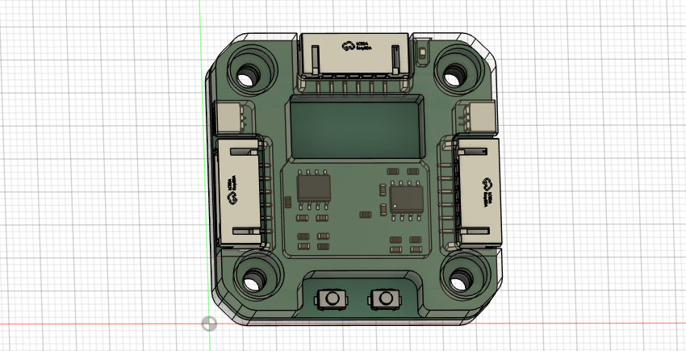
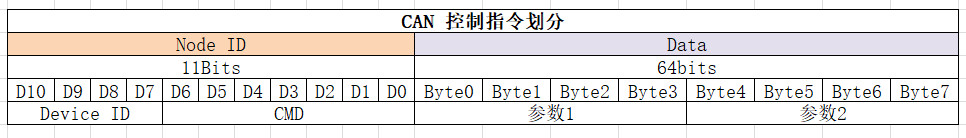
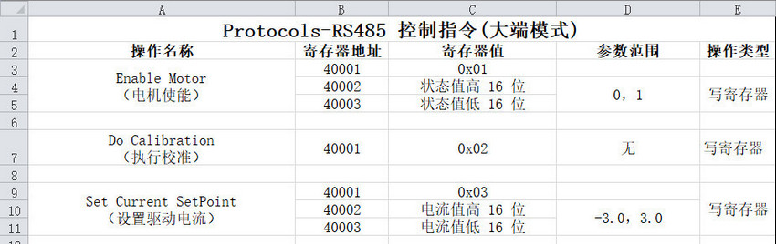
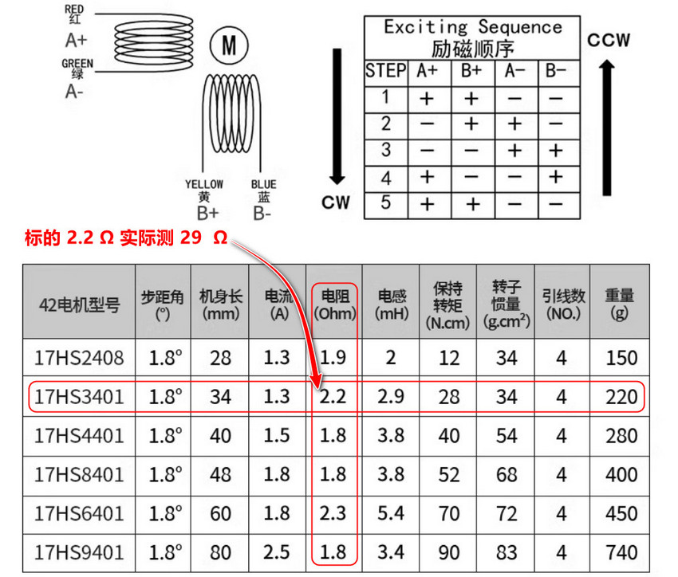
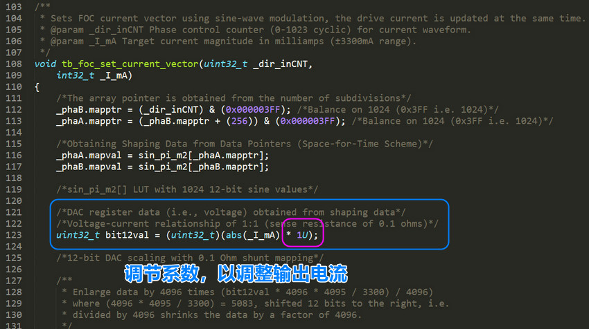

# Motor42

## 简介

如下图，是步进电机驱动器，可以一体化集成安装到 42 步进电机。板上集成磁编码器，具有速度，位置，电流闭环控制功能，解决步进电机高速丢步特性，实现恒定扭矩。支持 RS485+Modbus 和 CAN 总线级联（串联）控制通信，适用于 3D 打印机，舵机，小型机械臂。

## 硬件

PCB 打样使用制造输出文件（Gerber），打样时把所有 Gerber 文件压缩为 .zip 文件提供给 PCB 制造商（例如嘉立创）即可，PCB 经过我打样验证无误，Gerber 文件在 Docs 目录下，可直接使用。

原理图和 PCB 使用开源 EDA 工具 KiCAD 设计的，如果你有 KiCAD 也知道怎么使用，可以自己去导出 Gerber 文件。

PCB 采用 4层板设计，如果要编辑 PCB 需要下载 KiCAD，还需要看些教程熟悉使用方法，当然这个 EDA 工具本身也非常易学。

购买电子元器件按照 Docs 目录下的 BOM 表格购买。

KiCAD 官方下载链接： https://www.kicad.org/

KiCAD 工程目录：[HardWare/kiacd_project](./HardWare/kiacd_project)

制造输出文件（Gerber）目录：[Docs/Motor42-PCB](./Docs/Motor42-PCB/)

器件 BOM 目录：[Docs/Motor42-BOM.csv](Docs/Motor42-BOM.csv)

原理图 PDF 目录： [Docs/Motor42-SCH.csv](Docs/Motor42-SCH.pdf)

## 固件

程序固件使用 CMake 进行构建的，然后用 ARM-GCC 进行编译的，并且可以搭配 VSCode 和 OpenOCD 进行图形化调试，当然你可以新建一个 STM32F103 的 Keil 工程，把程序组织到 Keil 中编译也可以。

使用 CMake 要求会编写 `CMakeLists.txt` 文件，不过我这里已经编写好了，在 Firmware 目录下可以看到。

PCB 上预留了 SWD 调试接口，固件固件就可以使用 SWD 下载。

如果没有 VSCode 的嵌入式开发环境，可以看看这篇文章：[VSCode 和 CMake 搭建嵌入式开发环境](https://blog.csdn.net/jf_52001760/article/details/126826393)

## 安装

驱动器电路板集成安装到 42 步进电机需要结构支撑零件，零件在 Model 目录下。一个为支撑零件，另一个为保护板，把两个 .step 文件 3D 打印即可，零件样式就是简介中图示的样子。

磁编码器检测要在电机轴上安装径向磁铁，磁铁尺寸为 8mmx2mm，磁铁安装注意同心度不要过度偏移，磁铁与编码器的间隙大概为 1.0mm。

Model 支撑零件目录：[Model](./Model)

## 校准

电机第一次使用需要校准，长按两次按键 1 可以启动校准，校准时电机会慢速正转一圈再反转一圈。

## 按键逻辑

按下按键 1 作用是启动停止闭环模式，按下按键 2 的作用是模式参数清 0，例如当前控制模式为速度模式，那么按下按键 2 此时会将速度置为 0，电机随即停止。

## 通信协议

驱动器支持 RS485+Modbus 和 CAN 协议。

### CAN 协议

CAN 协议控制字段划分如下。

具体控制指令和控制方式查看 [Docs/Protocols](./Docs/Protocols) 目录下相应的协议文档，这里只截取部分。

### Rs485 协议

具体控制指令和控制方式查看 [Docs/Protocols](./Docs/Protocols) 目录下相应的协议文档，这里只截取部分。

## 问题

注意步进驱动器控制步进电机工作在位置环并要求静止在某个固定位置时可能会出现高频震动的问题。

引起高频微弱震动的原因是由于在位置环控制模式下，驱动器为了让让电机接近指定位置而控制电机在齿槽间反复微调而产生震动。

这个现象排除驱动器的电路问题（比如焊接的电流采样电阻是否正确等等），磁编码器检测磁铁的安装同心度问题（通常同心度要求不是很高，确保不要过度偏移即可）那有极大的可能是步进电机的相电阻过大导致的，可以更换了其他电机进行测试。

如果更换电机测试后发现同一个闭环步进电机驱动器驱动一个步进电机工作在位置环保持静止时工作正常，而驱动另一个步进电机静止时出现高频震动，那可以肯定就是相电阻过高而导致的。

出现震动现象的电机相电阻通常为 10-30 Ohm，而较好电机的相电阻通常为 2-5 Ohm。比如在上图中购买的步进电机在参数描述中标明的相电阻为 2.2 Ohm，实则实际测出的相电阻高达 29 Ohm，所以电机出现震动现象和线圈相电阻是有一定关系的。

如果不更换电机的情况下可以通过修改驱动器程序固件来修复这个问题，修改驱动输出部分，在最终 FOC 输出驱动电流部分添加一个系数即可，通过该系数来调节驱动器 FOC 的输出电流，如下图。

当然调节电流参数会对最终的扭矩有略微的影响，但并不影响闭环精度。
